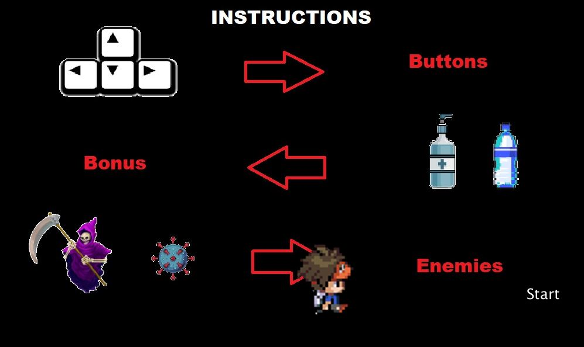
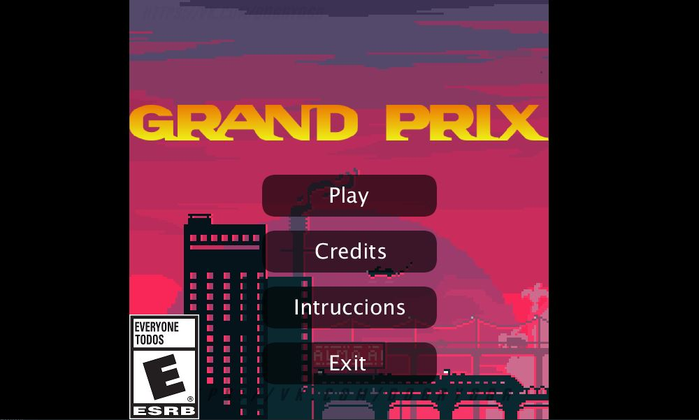
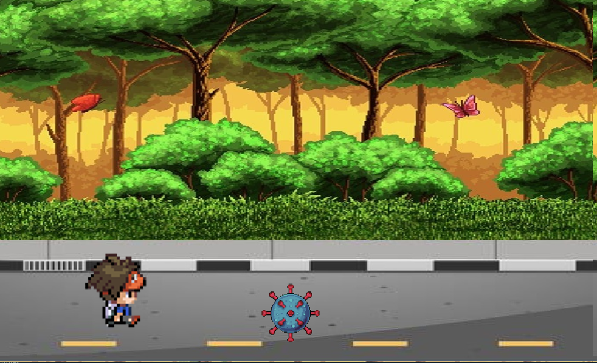

## Autores:

    2192987 - Gerson Alexander Sanchez Brito
    2182788  - Santiago Caballero Niño

## Descripcion

max, acaba de recibir un correo en el que le dicen que será vacunado así que debe ir hasta la gran ciudad desde su pueblo.sin embargo, debe evitar contagiarse de covid en el camino. y además debe mantener buenas prácticas de salud y seguridad en su aventura

 
     
    
    

## Instrucciones

## Imagenes

## Gameplay
- https://youtu.be/yMRLl0tI25Q

## clasificacion
apto para todo publico

.png)

## Agradecimientos 
Material grafico
- todos lo referentes a la parte visual del programa utilizada los encontrara referenciado en: [creditos](https://github.com/Computer-Programming-I-UIS/game-grand-prix/blob/main/game/data/creditos.txt)

Orientacion
- Alex Mantilla

game-grand-prix created by GitHub Classroom
